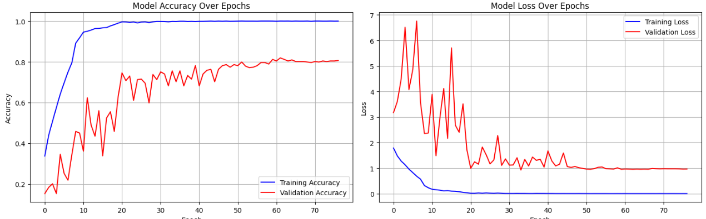

# 🎭 Mars Emotion Classification Project

A simple AI-powered speech emotion recognition system using deep learning and Streamlit.

## Demo Video
[https://youtu.be/KG1ZA7KDNzs](https://youtu.be/KG1ZA7KDNzs)
[https://youtu.be/G730wfVm400](https://youtu.be/G730wfVm400)

## 📋 Project Overview

This project implements a Convolutional Neural Network (CNN) to classify emotions from speech audio files. The system can identify **8 different emotions**: neutral, calm, happy, sad, angry, fearful, disgust, and surprised.

**Key Features:**

- Train emotion classification model using RAVDESS dataset
- Simple Streamlit web interface for audio upload and analysis
- Real-time emotion prediction with confidence scores
- Support for multiple audio formats (WAV, MP3, FLAC, M4A)


## 🚀 Project Setup

### 1. Install Dependencies

```bash
pip install -r requirements.txt
```

### 2. Train the Model

Run the Jupyter notebook to train and save the model:

```bash
jupyter notebook marsclassification.ipynb
```

This will generate: `final_emotion_model.h5` and `emotion_label_encoder.pkl`

### 3. Run the Streamlit App

```bash
streamlit run app.py
```

## 📁 Project Structure

```
├── marsclassification.ipynb    # Model training notebook
├── app.py                     # Simple Streamlit web app
├── test_setup.py              # Model testing script
├── requirements.txt           # Python dependencies
└── README.md                  # This file
```

## 🎯 How to Use

1. **Train Model**: Run the Jupyter notebook to create your emotion classification model
2. **Launch App**: Use `streamlit run app.py` to start the web interface
3. **Upload Audio**: Choose an audio file (WAV format recommended)
4. **Get Results**: Click "Analyze Emotion" to see the predicted emotion and confidence

## 🎭 Supported Emotions

- **Neutral** 😐 - Calm, no strong emotion
- **Calm** 😌 - Peaceful, relaxed state
- **Happy** 😊 - Joy, positive emotion
- **Sad** 😢 - Sorrow, negative emotion
- **Angry** 😠 - Rage, strong negative emotion
- **Fearful** 😨 - Scared, anxious emotion
- **Disgust** 🤢 - Repulsion, strong dislike
- **Surprised** 😲 - Shock, unexpected reaction

## 🔧 Technical Details

- **Model**: Convolutional Neural Network (CNN)
- **Input**: Mel-spectrograms (77 × 174)
- **Audio Duration**: 3 seconds (automatically padded/truncated)
- **Sample Rate**: 22,050 Hz
- **Framework**: TensorFlow/Keras
- **Dataset**: RAVDESS (Ryerson Audio-Visual Database)

## Model Performance

### Classification Matrix

![Classification Matrix](./images/matrix.png

### Loss Function Graph



 
